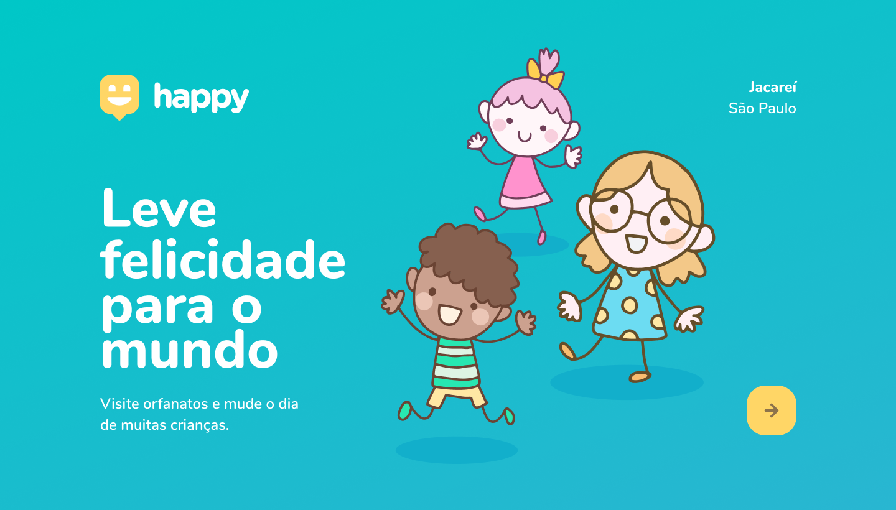

<h1 align="center">
    Happy - NLW#3
</h1>

  <a href="#bookmark-sobre">Sobre</a>&nbsp;&nbsp;&nbsp;|&nbsp;&nbsp;&nbsp;
  <a href="#rocket-tecnologias">Tecnologias</a>&nbsp;&nbsp;&nbsp;|&nbsp;&nbsp;&nbsp;
  <a href="#memo-licença">Licença</a>

  

## :bookmark: Sobre

O **Happy** é uma aplicação feita para facilitar o acesso e contado à orfanatos próximos à você.
  
Este projeto foi idealizado pensando no **12 de outubro**, onde se comemora o **Dia das Crianças**.
  
Essa aplicação foi realizada durante a Next **Level Week #3**, projeto da [Rocketseat](https://rocketseat.com.br/).

## :rocket: Tecnologias

- [Typescript](https://www.typescriptlang.org/)
- [ReactJS](https://reactjs.org/)
- [Node.js](https://nodejs.org/en/)
- [React Native](http://facebook.github.io/react-native/)
- [Expo](https://expo.io/)
- [Express](https://expressjs.com/)
- [Axios](https://github.com/axios/axios)

## :memo: Licença

Esse projeto está sob a licença MIT. Veja o arquivo [LICENSE](LICENSE.md) para mais detalhes.

---

Desenvolvido com 💜 por <strong>Erick Reis</strong>
